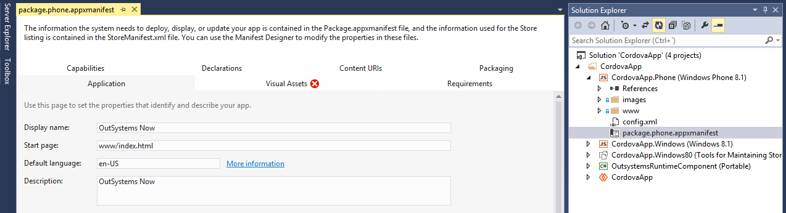
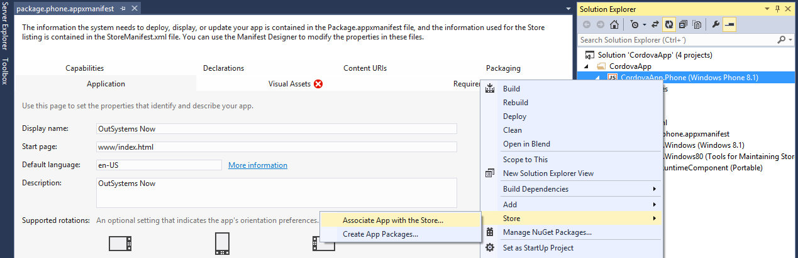
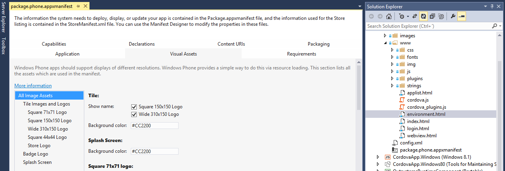
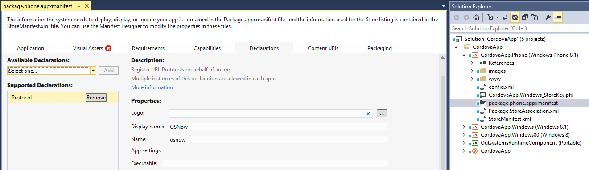

# OutSystems Now (Windows)

This is the open source code for the old version of OutSystems Now.
This version of OutSystems Now, brings your OutSystems experience to your mobile device, providing a fast way to access all your applications, including CRM, Customer Portal, or any other custom app built with the OutSystems Platform.

Note that this is a **deprecated version of OutSystems Now and is no longer supported** by OutSystems. You can find more details on the [OutSystems Now website](https://now.outsystems.com/).

The source code is made available for you to create your own version of the application.

This way you can apply your own branding, such as the application name, logo and splash screens.

You can also have control over push notifications and enhance your business with a true mobile experience

## Requirements

You will need a Windows development environment such as Visual Studio 2013 and a [Windows Store Developer](https://appdev.microsoft.com/StorePortals/en-us/Home/Index) account. You can submit the application to Windows Store if it complies with the store guidelines. **The newly created application will be under your responsibility and should be supported by you**.

## Steps for building your own customized OutSystems Now

### 1. Get the source code

You can clone (or fork) the repository or just download it as a zip file to have a local copy.

### 2. Setup your development environment

If you have not already have the development environment, download and install [Microsoft Visual Studio](https://www.visualstudio.com/) in your computer.
Open the **CordovaApp.sln** solution file (in the folder platforms\windows).

### 3. Customize your OutSystems Now

Open the GitHub source code in your development environment and you are ready to start building your own version of the application. 

To learn more about the Windows development you can check out [Windows Universal Apps](https://dev.windows.com/en-us/develop/building-universal-windows-apps) guide.

#### Change the application name

Submitting your own Windows App to the Windows Store means that you need to reserve your **app name first**. This action will ensure that no one else uses the name. Learn how you can [reserve your app name](https://msdn.microsoft.com/en-us/library/windows/apps/hh868182.aspx). After reserving you app name you need to change the display name. To change the **display name** of your app, follow the next instructions:

* In the Solution Explorer, double-click on the **appxmanifest** file of **CordovaApp.Phone** project
  * Select the **Application** tab
  * Change the **Display name**
  * Repeat these steps for the **CordovaApp.Windows** project
  
  

Now that you have changed the display name of your app, you need to associate your app with the app name that you initially reserved for Windows Store submission. To associate your app with the Store,follow the next instructions:

* In the Solution Explorer, right-click on the **CordovaApp.Phone** project
  * Select **Store**
  * Click on **Associate App with the Store**
  * Sign in to the Windows Phone Store
  * Select the **App Name** for your app
  * Associate your app
  * Repeat these steps for the **CordovaApp.Windows** project

  

#### Replace the application logo and splash screens

In your Visual Studio project you can find all images related with the application **logo** and **splash screen** on the Visual Assets tab of the **appxmanifest** file of your CordovaApp projects. You will need several different image sizes due to the multitude of devices. You can find that **images** under the images folder (platforms > windows > images).

You will also want to customize the OutSystems logo image that appears on the first screen, where the user types the environment address. You can find that image (**logo_original.png**) under the **img** folder (platforms > windows > www > img). Replace it with an image with the same dimensions (530x80) and a transparent background. If you need help creating icons and splash screen, there are several websites, such as [TiCons](http://ticons.fokkezb.nl/), that can help you generate all the necessary files.

#### Enable Push Notification on your application

To push notifications we suggest that you use a third-party service such as [Pushwoosh](http://www.pushwoosh.com/) or [UrbanShip](http://urbanairship.com/) (paid services).  These services simplify the whole process of pushing notifications and, better yet, they provide a single way of doing it for iOS, Android and Windows. No need to develop custom push mechanisms for each vendor. There are several other companies offering the same services and you can work with any of those if you wish. Most of them are paid services, so a subscription fee may be necessary.

To learn more about Push Notifications, check out the online information about [Push notifications for Windows Phone](https://msdn.microsoft.com/en-us/library/windows/apps/ff402558%28v=vs.105%29.aspx).

#### Enable Deep Linking on your application

To enable the deep linking feature on your own application you need to change the **Application Protocol**. Open the AppManifest file of the Windows Phone project and select the Declarations tab. Find the **Protocol** declaration and change both the **Display Name** and **Name**. Repeat these steps for the AppManifest file of the Windows 8.1 project.

### 4. Publish to the store

Once you have your own version of the OutSystems Now application, you can distribute it. Learn how you can do it with the [Publish Windows apps and games](https://dev.windows.com/en-us/publish) guide for Windows.